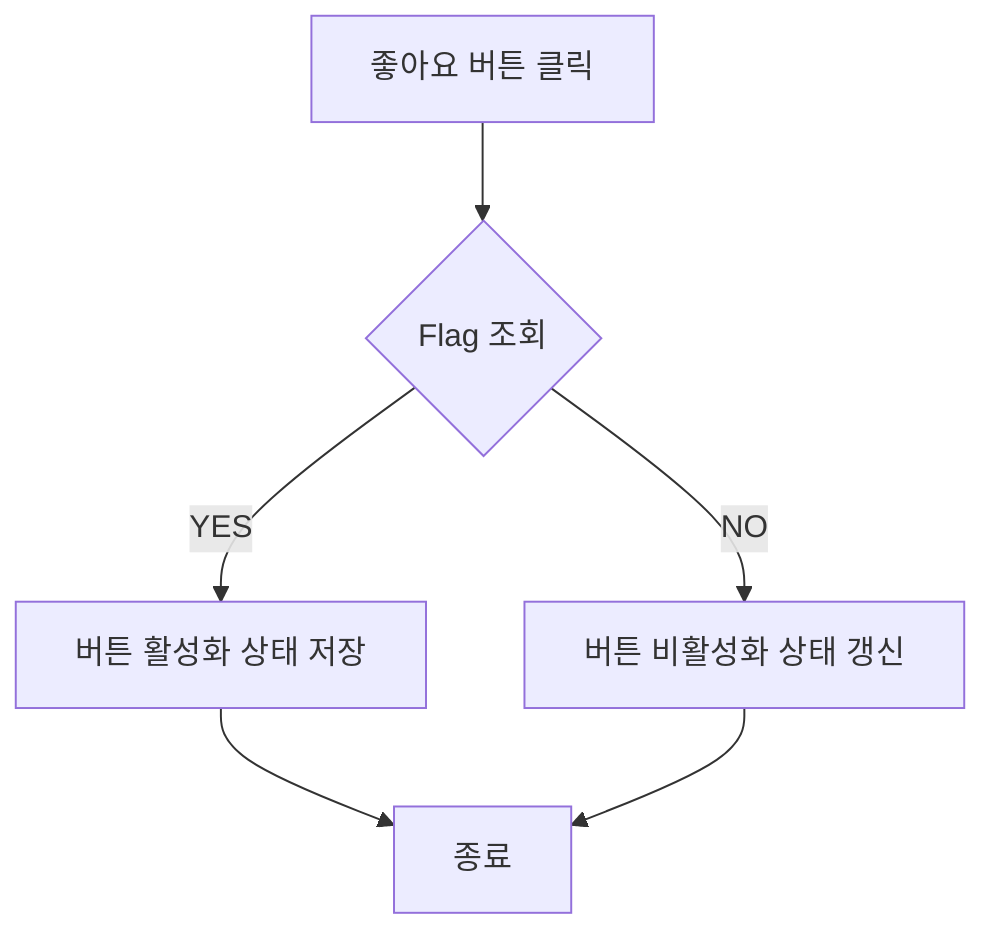
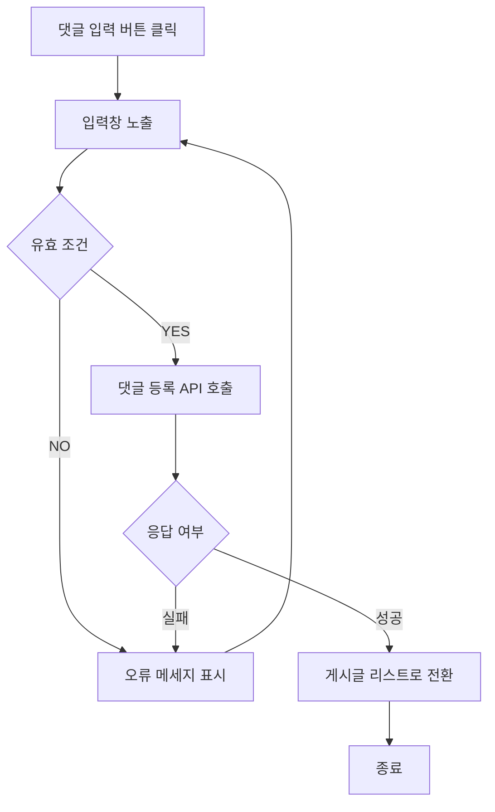
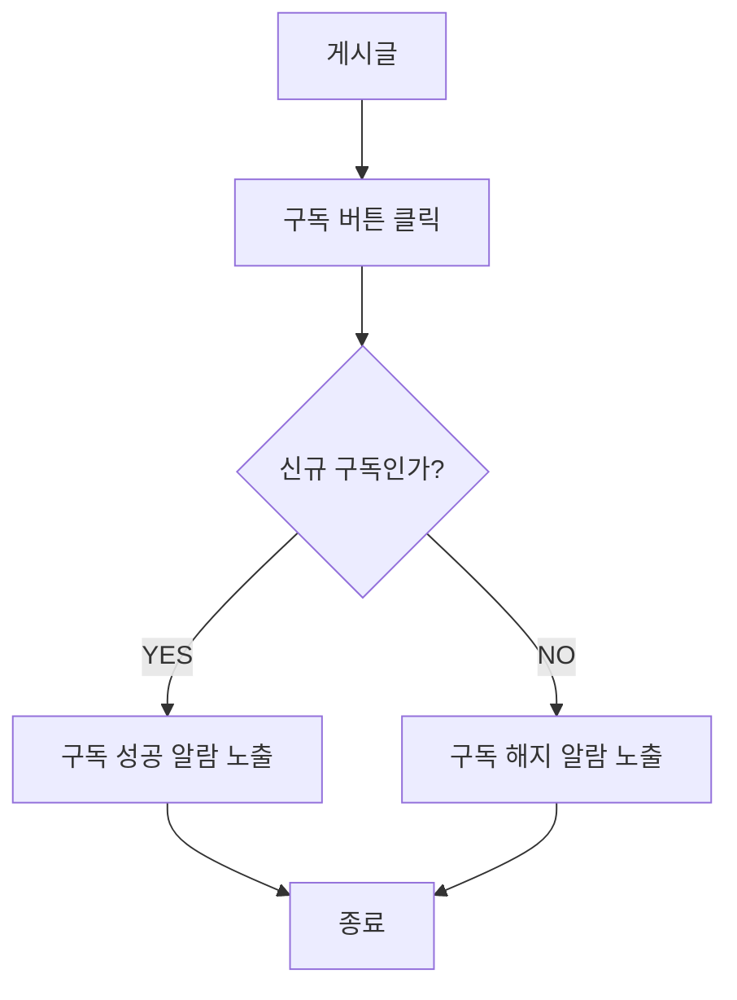

## 게시글 반응 사용자 스토리

### 나는 일반 사용자로서, 다른 사용자의 게시물에 반응을 남기고 싶습니다.

#### 기능명: 게시글 반응

- 기능 설명
    - 좋아하는 게시물에 버튼과 간단한 텍스트를 통해 상호작용 한다.
- 입력 항목
    - 사용자/게시물 ID: 고유 식별자
    - Liked flag: Boolean. 현재 좋아요 상태
    - (댓글) 입력된 문자열: 문자열, 최대 300자
    
#### 사용자 액션

**반응 남기기**

- 좋아요 버튼 클릭
    - 사용자 정보와 게시물 ID를 통해 이미 좋아요 한 게시글 감별
    - 아닌 경우 버튼 활성화,  좋아요 한 게시글 상태 참으로 변경
    - 맞는 경우 버튼 비활성화, 좋아요 한 게시글 상태 거짓으로 갱신

**댓글 남기기**
- 댓글 남기기 버튼 클릭
    - 입력창 노출 및 사용자 입력
    - 입력 항목이 유효한지 감별
    - 아닌 경우 오류 메시지 표시 후 입력창으로 돌아감
    - 맞는 경우 댓글 등록 API 호출
    - 댓글 등록 API 호출 성공 시 댓글 리스트로 이동
    - 댓글 등록 API 호출 실패 시 오류 메세지 표기 후 입력창으로 돌아감

## 타 이용자 구독 사용자 스토리

### 나는 일반 사용자이며, 관심 있는 사용자를 구독하여 업로드한 콘텐츠를 받아보고 싶습니다.

#### 기능명: 사용자 구독

- 기능 설명
    - 전환 버튼을 통해 게시물의 사용자를 구독한다. 이미 구독한 사용자인 경우 구독을 해지한다.
- 입력 항목
    - 사용자 ID: 고유 식별자
    - Follow flag: Boolean. 현재 구독 여부
#### 사용자 액션
**구독 버튼 클릭**
- 현재 구독 여부 판별
- 해당하는 조건(구독중인 경우 해지/아닌 경우 성공)의 메세지 노출 후 종료

